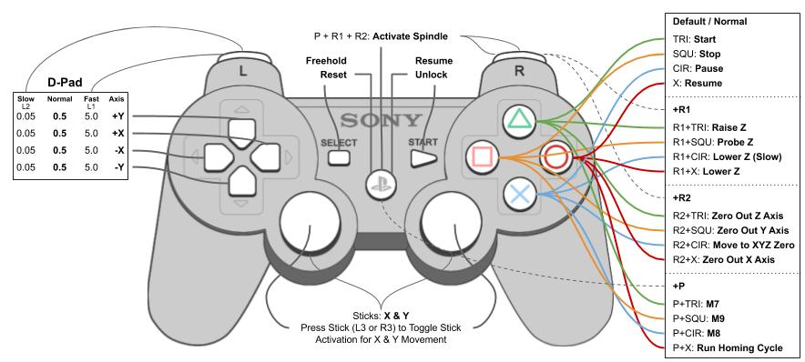
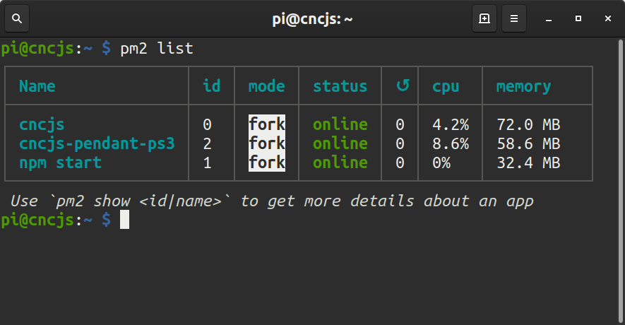

# Dual Shock 3 Remote Pendant for CNCjs

I purchased an offline controller for my woodpecker cnc board and was quickly disapointed that I could not use CNCjs while it was connected. It also lacked controls for zeroing out the work surface and was tiny. I found cnc-pendant-js, which had almost all the commmands I wanted and some open buttons.

This fork is a modified version of [cncjs-pendant-ps3]() where you will find detailed instructions on connecting your [Dualshock 3 controller](https://www.playstation.com/en-us/explore/accessories/dualshock-3-ps3/) via wire and bluetooth.  I got a cheap clone "P3" controller working.

For about the same price as the offline controller I think the dualshock 3 is a much more comfortable and capable pendant option. I added the R2 modified commands for zeroing out the axes and going to the home position to the empty R2 modified button commands. 

I am really starting to like the controller layout from cncjs-pendant-ps3 and can now do most of what I need with the controller. I may add the Z probe command to one of the PSX modified buttons (+P on the button map) that are currently mapped to cooling functions that are unused on my machine.



 [PS3 CNC Control Button Map Google Drawing](https://docs.google.com/drawings/d/1PdNYWQexs-ckQcoG5lmz6B-brYfwW1SJI2Fqjip_APQ/edit?usp=sharing)

## Installation Instructions 

CNCjs currently runs best on node version 8, these instructions assume you have NPM and NVM installed. Get started by setting the version of node and installing some required packages for bluetooth and building packages. 

### Install Node v8 and dualshock-controller and cncjs-pendant-ps3 node apps locally
```
# Prepare the Raspbery Pi
nvm install 8
nvm use 8
apt install build-essential git bluetooth libbluetooth3 libusb-dev
npm install node-gyp node-pre-gyp

# Clone build and link dual-shock-controller and cncjs-pendant-ps3

git clone https://github.com/garthvh/node-dualshock-controller.git
cd node-dualshock-controller
npm install
npm link 
cd
git clone https://github.com/garthvh/cncjs-pendant-ps3.git
cd cncjs-pendant-ps3
npm link dualshock-controller
npm install -g --unsafe-perm
```
You should now be able to connect your controller using 
```
cncjs-pendant-ps3 -p "/dev/ttyUSB0"
```

## Auto Start and Restart
For my Raspberry Pi CNCjs machine controller I use PM2 to start the processes I need on boot, and to restart them when they crash.  This is expecially important for the pendant because it throws an error when the controller goes to sleep and the bluetooth disconnects.  Using PM2 the pendant software is always ready to connect the controller and get to work.

### Install [Production Process Manager [PM2]](http://pm2.io)

```
# Install Production Process Manager [PM2]
npm install pm2 -g

# Setup PM2 Startup Script
pm2 startup
#[PM2] You have to run this command as root. Execute the following command once:
sudo su -c "env PATH=$PATH:/home/pi/.nvm/versions/node/v8.1.6/bin pm2 startup debian -u pi --hp /home/pi"

# Start Dual Shock / PS3 Bluetooth Remote Pendant for CNCjs (conected to serail device @ /dev/ttyUSB0) with PM2
pm2 start $(which cncjs-pendant-ps3) -- -p "/dev/ttyUSB0"

# Set current running apps to startup
pm2 save

# Get list of PM2 processes
pm2 list
```

 ## Updates 

I had to make a number of updates to get the cncjs-pendant-ps3 and dualshock-controller node packages working properly on a raspberry pi running raspbian buster lite 2019-07-10.

* Add R2 modified button commands to index.js for zeroing out the work area
* Comment out extras function that throws node-hid error
* Clone, build and link node-dualshock-controller package version 1.1.2 using node-hid 0.7.9

Because of these changes I had to fork the two git repositories and am no longer able to install directly from NPM.